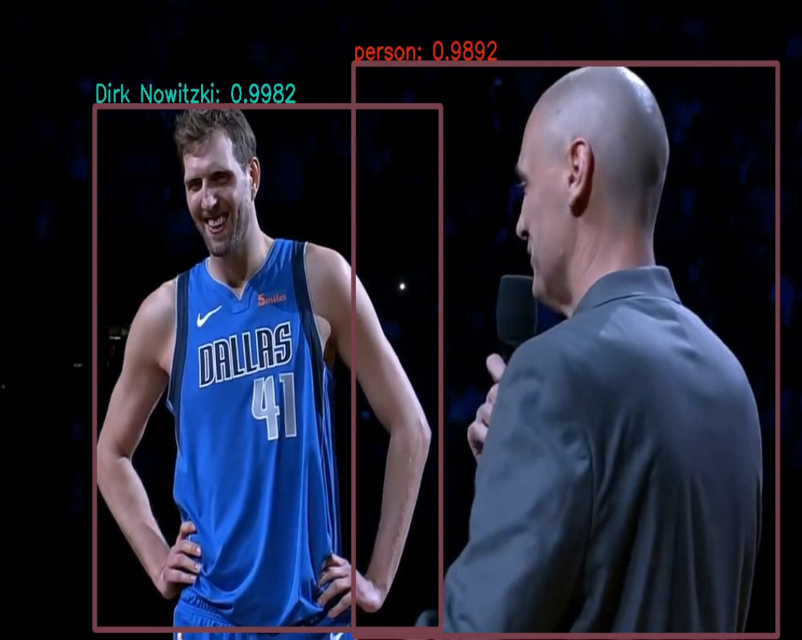

# Yolov3-Face-Recognition
This project detects objects with Yolo-v3 and tries to recognize objects that are classified as "person" in Yolo. 


## Output Sample 




## Getting Started

### Prerequisites
- ``python3.5+``
- ``virtualenv``
#### Download
- Download YOLOv3 wieghts and copy them into **yolo/** folder.
```
wget https://pjreddie.com/media/files/yolov3.weights
```
- Download the  **cfg/yolov3.cfg** and **data/coco.names** from [Darknet](https://github.com/pjreddie/darknet) and move them to **yolo/** folder.
- Create a virtualenv and install the python packages 
```
virtual env -p python3.5 venv
source venv/bin/activate 
pip install -r requirements.txt
```  
## Usage 

##### - Prepare Data

- Create a folder structure in **face_module/data/facebank/** for faces that you want to recognize.

```
data/facebank/
        ---> id1/
            ---> id1_1.jpg
        ---> id2/
            ---> id2_1.jpg
        ---> id3/
            ---> id3_1.jpg
           ---> id3_2.jpg

```

#### - Run

- ``yolov3.py -i INPUT -o OUTPUT -y YOLO [-c CONFIDENCE] [-n NMS]``

Example
- ``yolov3.py -i inputs/harvard.mp4 -o outputs/out -y yolo/ `` 
#### Arguments
```
-i INPUT, --input INPUT
                        Path to input video
  -o OUTPUT, --output OUTPUT
                        Path to output video
  -y YOLO, --yolo YOLO  Path to YOLO
  -c CONFIDENCE, --confidence CONFIDENCE
                        Confidence threshold
  -n NMS, --nms NMS     Non-maximum suppression threshold

```
- NMS default  **0.4** 
- Confidence default **0.5**


## Built With

* [OpenCV](https://opencv.org/) 
* [Pytorch](https://maven.apache.org/)


## License

This project is licensed under the MIT License - see the [LICENSE.md](LICENSE.md) file for details

## References

* I've used  **[InsightFace_Pytorch](https://github.com/TreB1eN/InsightFace_Pytorch)**  for face recognition. 
* This repo mainly inspired from [Adrian Rosebrock's](https://www.pyimagesearch.com/2018/11/12/yolo-object-detection-with-opencv/) code.
